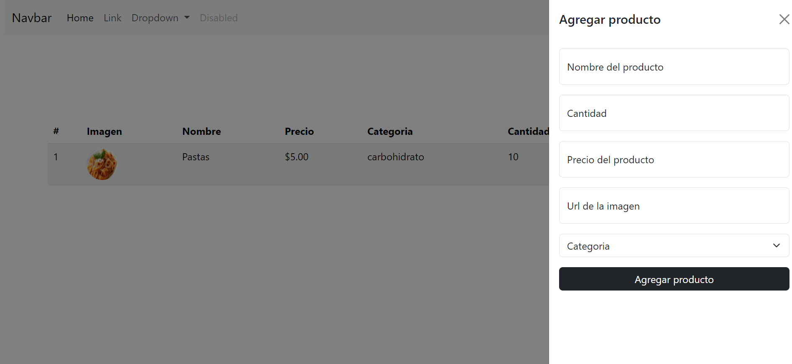

# Inventory Management System

This repository contains a comprehensive Inventory Management System built with HTML, CSS, JavaScript, and Bootstrap. The system provides full CRUD (Create, Read, Update, Delete) functionality for managing products, along with the additional feature of requesting a reference image for each product.

## Features

- **Complete CRUD Operations**: Allows users to Create, Read, Update, and Delete product entries.
- **Product Image Reference**: Capability to upload and display reference images for each product.
- **Responsive Design**: Utilizes Bootstrap for a responsive and visually appealing layout.
- **Intuitive User Interface**: Simple and user-friendly interface for seamless navigation.
- **Data Persistence**: Utilizes browser storage for persistent data storage.
- **Validation and Error Handling**: Implements validation and error handling for data integrity.

## Technologies Used

- **HTML**: Markup language for structuring the content.
- **CSS**: Stylesheets for design and layout.
- **JavaScript**: Provides interactivity and logic for the application.
- **Bootstrap**: Front-end framework for responsive design and UI components.
